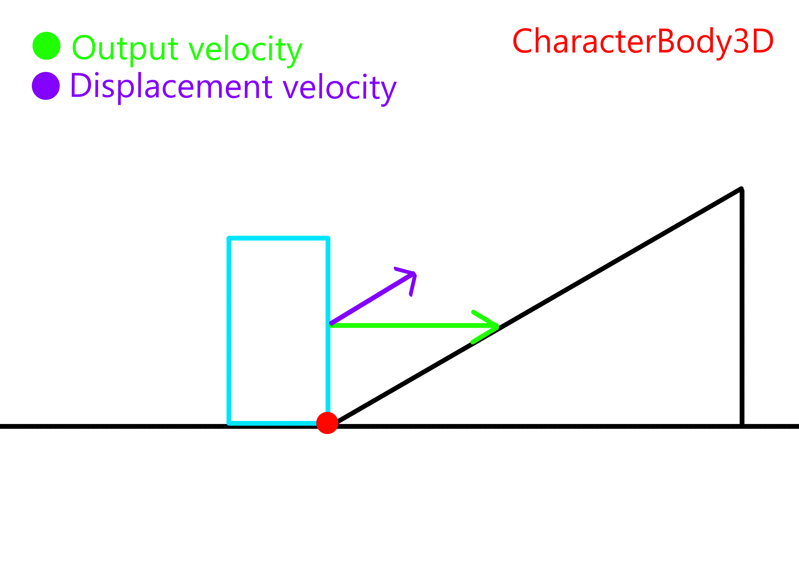
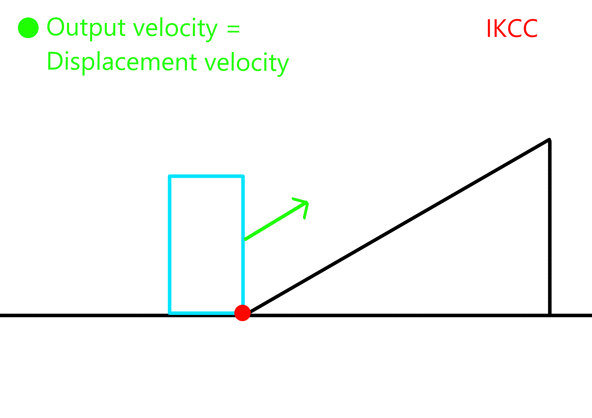

# IKCC Guide

The purpose of this guide is to point out and explain potential differences in how you might code character controllers with `IKCC` compared to `CharacterBody3D`.

I recommend checking out the [`example character controller`][xpl] in the demo project If you want to see how you can implement some common features for your character controller using `IKCC`.

The class properties and methods are documented inside [`ikcc.gd`][spt].

## 1. Velocity on floors

*Input velocity* refers to the value of `velocity` right before `move_and_slide` is callled.
*Output velocity* refers to the updated value of `velocity` right after `move_and_slide` is done simulating the body.
*Displacement velocity* is the velocity that is used to calculate the displacement and is updated during the movement simulation.

### CharacterBody3D

One of the (incorrect) principles followed by `CharacterBody3D`, is that **floor collisions do not affect the output velocity, apart from the downward component being removed if the body collided with a floor**. If the input velocity is horizontal (parallel to the plane defined by `up_direction`), then the output velocity also remains horizontal. This is done by simply not updating `velocity` to match the final calculated displacement velocity. It's a cheap way to increase/decrease the speed of the body on floor slopes, one that breaks inertia.

    

A common act in character controllers written for `CharacterBody3D` is the seperate modification of the horizontal and vertical components of `velocity`. **The horizontal velocity is thought as the velocity the body moves along the floor with when it's on floor, and the vertical velocity is thought as the velocity the body jumps and falls with.** According to this, if the vertical velocity is not zero, then the body must be jumping or falling. **This logic does not work well with a physically accurate body**, just think of a body moving along a slope, it's velocity should definietly not be horizontal, it should align with the slope.

### IKCC

`IKCC` does not follow the above mentioned limitations of `CharacterBody3D`. The **output velocity is always the "real" velocity of the body**, one that is calculated by the movement algorithm , therefore **floor collisions correctly update `velocity`**.

    

**When the body snaps to the floor any component of `velocity` that would cause the body to detach from the floor is removed**, essentially making `velocity` parallel to the floor when the body is moving downhill. This makes sense, since the purpose of floor snapping is to keep the body from leaving the floor by "artificially forcing it" to move along it's surface.

In practice, this means **you shouldn't think of the horizontal velocity as the velocity the body moves along the floor with, the body moves where `velocity` points to, just like a real body would**. **If the body is moving along a floor, it means `velocity` is parallel to it.** Think about the direction in which you want to apply a given acceleration/deceleration to the body, and adjust `velocity` accordingly. (Do I really want this acceleration/deceleration to be horizontal, or do I want to accelerate/decelerate the body along the floor?)

Floor friction/deceleration for example should not be applied only to the horizontal component of `velocity` when the body is moving along a floor slope (it would be a weird change in `velocity`), it should be applied in the opposite direction of `velocity` instead. When the body is in the air though, applying air friction only to the horizontal component is definietly something you can do.

[spt]: ../ikcc.gd
[xpl]: ../../entities/actor/player/player_body.gd
